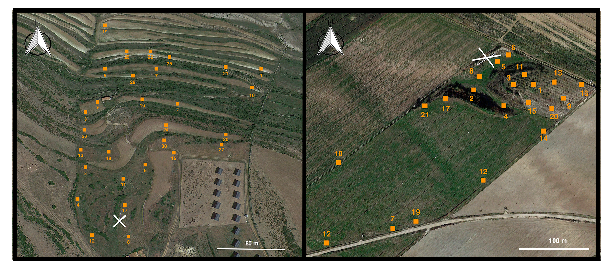

---
output:
  pdf_document: default
  html_document: default
classoption: landscape
---

```{r setup, echo=FALSE, warning=FALSE}
# set global chunk options: 
library(knitr)
opts_chunk$set(cache=FALSE, autodep = TRUE)
#dep_auto()

```

```{r, echo=FALSE, message=FALSE, cache=FALSE, warning=FALSE, out.width="100%", fig.align='center'}

```
