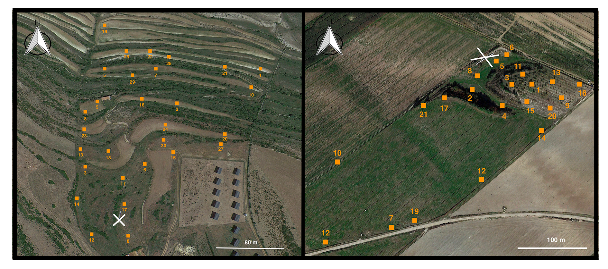

---
output:
  pdf_document: default
  word_document: default
bibliography: ../references.bib
header-includes:
- \usepackage{caption}
- \captionsetup[figure]{labelformat=empty}
- \usepackage{float}
- \floatplacement{figure}{H}

---

# Analytical report of plant-pollinator networks from Cantavieja and Ejea de los Caballeros

**I. Bartomeus, J. B. Lanuza, O. Aguado, E. Nuñez**

```{r setup, echo=FALSE, warning=FALSE}
# set global chunk options: 
library(knitr)
opts_chunk$set(cache=FALSE, autodep = TRUE)
dep_auto()

```

## Objectives

*Some text here*

## Field sampling

Two distinct locations are being monitored with different historical land-use and management in the region of Aragón (Spain): Cantavieja (40º 30' 44", N 0º 22' 59" W) at 1450m above sea level with a total of 30 plots and Ejea de los Caballeros (42º 01' 06" N, 1º 08' 53" W) at 350m with a total of 21 plots. Plot size is 2m by 2m and they are randomly distributed within each location (see **Figure 1**). Importantly, since the start of the project vegetation has remained undisturbed without grazing or clearing.


```{r echo=FALSE, out.width='100%', fig.cap="\\textbf{Figure 1.} Cantavieja (left) and Ejea de los Caballeros (right) locations with the different sampling plots indicated with an orange square plus the plot identifier. The position of the bee hives are shown with a white cross for both locations."}



```


```{r, echo=F, warning=FALSE,message=FALSE}

#DATA PREPARATION

#Data processing and preparation for visualization and analysis

#First,load libraries
library(dplyr)
library(reshape2)
library(bipartite)

#Read data
data <- read.csv("../Data/life_polinizadores.csv")

#check structure of the data
#str(data)

#create separate datasets for the two different locations
canta <- data %>% filter(site_id=="cantavieja")
ejea <- data %>% filter(site_id=="ejea caballeros")

#select for now plant and pollinator species to create plant-pollinator networks from transects
canta_species <- canta %>% select(c("plants", "pollinators"))
ejea_species <- ejea %>% select(c("plants", "pollinators"))

#Now aggregate pollinator visits per plant species
canta_aggreagted <- canta_species %>% count(plants, pollinators, sort = TRUE)
ejea_aggreagted <-  ejea_species %>% count(plants, pollinators, sort = TRUE)

#Now convert to a matrix with the help of acast function from reshape library
canta_matrix <- acast(canta_aggreagted, plants~pollinators, value.var="n")
ejea_matrix <- acast(ejea_aggreagted, plants~pollinators, value.var="n")

#Convert NA's to zeros
canta_matrix[is.na(canta_matrix)] <- 0
ejea_matrix[is.na(ejea_matrix)] <- 0
```

\newpage

## Data visualization

### Location 1 'Cantavieja'

```{r,echo=F,warning=FALSE,message=FALSE,dpi=300, fig.align='center', fig.cap="\\textbf{Figure 2.} Bipartie plant-pollinator network from Cantavieja location. Pollinators are coloured in orange and plants in green. The width of the conection between plants and pollinators represent the strength of the interaction (number of links) and the width of the different nodes corresponds to the total number of links."}

library(stringr)

#Set species names in italic
par(font = 3)

#Select just 2 words (avoid subspecies for margins)
colnames(canta_matrix) <- word(colnames(canta_matrix),1,2, sep=" ")
colnames(canta_matrix) <- word(colnames(canta_matrix),1,2, sep=" ")

#Seems better to omit labels they are being cut off

#Plot location 1
plotweb(sortweb(canta_matrix, sort.order="dec"), method="normal", text.rot=90, col.low = "darkolivegreen1", col.high = "darkorange",col.interaction="gray75",
bor.col.interaction ="NA", labsize =0.3, high.lablength=0,low.lablength=0)
```

### Location 2 'Ejea caballeros'

```{r,echo=F,warning=FALSE,message=FALSE,dpi=300, fig.align='center', fig.cap="\\textbf{Figure 3.} Bipartie plant-pollinator network from Ejea de los Caballeros location. Pollinators are coloured in orange and plants in green. The width of the conection between plants and pollinators represent the strength of the interaction (number of links) and the width of the different nodes corresponds to the total number of links."}

#Select just 2 words (avoid subspecies for margins)
colnames(ejea_matrix) <- word(colnames(ejea_matrix),1,2, sep=" ")
colnames(ejea_matrix) <- word(colnames(ejea_matrix),1,2, sep=" ")

#Plot location 2
plotweb(sortweb(ejea_matrix, sort.order="dec"), method="normal", text.rot=90, 
col.low = "darkolivegreen1", col.high = "darkorange",
col.interaction="gray75",bor.col.interaction ="NA", labsize =0.3, high.lablength=0,low.lablength=0)

```

\newpage

## Analysis of network structure

Two main aspects of network structure are going to be analyzed for each location: weighted nestedness (NODF) implemented in @almeida2008 and the quantitative version of modularity [@dormann2014]. To understand how nested or modular are these two networks, the resulting values are compared with nestedness and modularity values of the same networks after randomization (N=1000). In addition, the overall specialization or 'selectiveness' as estimated in @bluthgen2006 is also going to be explored. All analysis are conducted in @R version _4.0.5_. 

### Location 1 'Cantavieja'

```{r,echo=F,warning=FALSE,message=FALSE,dpi=300, out.width="80%", fig.align='center',fig.cap="\\textbf{Figure 4.} Density plot of the nestedness values for the different random networks (N=1000). The red vertical line indicates the observed nestedness in Cantavieja."}

#Calculate nestedness for cantavieja
obs_canta <- networklevel(web = canta_matrix, index = "weighted NODF")

#To know the meaning of our nestedness value we have to compare it with a randomized version
#of our plant-pollinator network
#Create 1000 random versions of our network
nm_canta <- nullmodel(web = canta_matrix, N=1000, method="r2d") #method 2 for quantitative networks

#Prepare data for plotting
null_canta <- unlist(sapply(nm_canta, networklevel, index="weighted NODF"))

#Plot the distribution of nestedness of the 1000 random networks
plot(density(null_canta), xlim=c(min(obs_canta, min(null_canta)), max(obs_canta, max(null_canta))),
     main="Comparison of observed network with null model (Cantavieja)",cex.main=1)

#Add our value of nedtedness to the plot
abline(v=obs_canta, col="red", lwd=2)

#Calculate p-value
praw_canta <- sum(null_canta>obs_canta) / length(null_canta)
```

Nestedness of the plant-pollinator network from Cantavieja is similar to the one that is expected by chance (P value = `r praw_canta`). This indicates that smaller subsets of interacting species are not contained in larger subsets of interacting ones.

```{r, echo=F,warning=FALSE,dpi=300,out.width="150%", fig.align='center',fig.cap="\\textbf{Figure 5.} Interaction modules of the plant-pollinator network from Cantavieja."}

#Try to plot modularity with shorter labels
canta_matrix_2 <- canta_matrix
library(stringr)
colnames(canta_matrix_2) <- word(colnames(canta_matrix_2),1,2, sep=" ")
rownames(canta_matrix_2) <- word(rownames(canta_matrix_2),1,2, sep=" ")

res_canta_2 <- computeModules(canta_matrix_2)

#Plot modules
plotModuleWeb(res_canta_2, labsize = 0.2)

```


```{r, echo=F,warning=FALSE,dpi=300,out.width="80%"}

#Calculate modules for each random network
#It takes quite a bit time to run
#So I load already the outputs
#modules.nulls_canta <- sapply(nm_canta, computeModules)
#like.nulls_canta <- sapply(modules.nulls_canta, function(x) x@likelihood)
res_canta <- computeModules(canta_matrix)

modules.nulls_canta <- readRDS("../Data/modules.nulls_canta.rds")
like.nulls_canta <- readRDS("../Data/like.nulls_canta.rds")

#Calculate p-value
praw_canta_mod <- sum(like.nulls_canta > res_canta@likelihood) / length(like.nulls_canta)
```

Cantavieja plant-pollinator network is more modular than expected by chance (P-value = `r praw_canta_mod`). This suggest that the are subgroups or modules of species with strong connections but these modules are weakly connected. This also supports the lack of nestedness found previously.

```{r, echo=F,warning=FALSE,dpi=300,out.width="80%"}
ch <- H2fun(canta_matrix, H2_integer=TRUE)
ch <- format(round(ch, 2), nsmall = 2)
ch <- as.numeric(ch) 
```

The overall network specialization (H2) is `r ch[1]`. 

### Location 2 'Ejea de los Caballeros'


```{r,echo=F,warning=FALSE,message=FALSE,dpi=300, out.width="80%", fig.align='center',fig.cap="\\textbf{Figure 6.} Density plot of the nestedness values for the different random networks (N=1000). The red vertical line indicates the observed nestedness in Ejea de los Caballeros"}

#Calculate nestedness for cantavieja
obs_ejea <- networklevel(web = ejea_matrix, index = "weighted NODF")

#To know the meaning of our nestedness value we have to compare it with a randomized version
#of our plant-pollinator network
#Create 1000 random versions of our network
nm_ejea <- nullmodel(web = ejea_matrix, N=1000, method="r2d") #method 2 for quantitative networks

#Prepare data for plotting
null_ejea <- unlist(sapply(nm_ejea, networklevel, index="weighted NODF"))

#Plot the distribution of nestedness of the 1000 random networks
plot(density(null_ejea), xlim=c(min(obs_ejea, min(null_ejea)), max(obs_ejea, max(null_ejea))),
     main="Comparison of observed network with null model (Cantavieja)",cex.main=1)

#Add our value of nedtedness to the plot
abline(v=obs_ejea, col="red", lwd=2)

#Calculate p-value
praw_ejea <- sum(null_ejea>obs_ejea) / length(null_ejea)
```


The plant-pollinator network from Ejea de los Caballeros is also non-nested (P-value = `r praw_ejea`).


```{r, echo=F,warning=FALSE,dpi=300,out.width="150%",fig.align='center', fig.cap="\\textbf{Figure 7.} Interaction modules of the plant-pollinator network from Ejea de los Caballeros"}

#Try to plot modularity with shorter labels
ejea_matrix_2 <- ejea_matrix
library(stringr)
colnames(ejea_matrix_2) <- word(colnames(ejea_matrix_2),1,2, sep=" ")
rownames(ejea_matrix_2) <- word(rownames(ejea_matrix_2),1,2, sep=" ")

res_ejea_2 <- computeModules(ejea_matrix_2)

#Plot modules
plotModuleWeb(res_ejea_2, labsize = 0.2)

```


```{r, echo=F,warning=FALSE,dpi=300,out.width="80%"}

#Calculate modules for each random network
#It takes quite a bit time to run
#So I load already the outputs
#modules.nulls_canta <- sapply(nm_canta, computeModules)
#like.nulls_canta <- sapply(modules.nulls_canta, function(x) x@likelihood)
res_ejea <- computeModules(ejea_matrix)

modules.nulls_ejea <- readRDS("../Data/modules.nulls_ejea.rds")
like.nulls_ejea <- readRDS("../Data/like.nulls_ejea.rds")

#Calculate p-value
praw_ejea_mod <- sum(like.nulls_ejea > res_ejea@likelihood) / length(like.nulls_ejea)
```

Similar to Cantavieja, the plant-pollinator of Ejea de los Caballeros is also more modular than expected by chance (P-value = `r praw_ejea_mod`). Again, this indicates the presence of subgroups of species with strong connections but weakly connected between these subgroups or modules.

```{r, echo=F,warning=FALSE,dpi=300,out.width="80%"}
eh <- H2fun(ejea_matrix, H2_integer=TRUE)
eh <- format(round(eh, 2), nsmall = 2)
eh <- as.numeric(eh) 
```

The overall network specialization (H2) is `r eh[1]`. 

## References

<div id ="refs"></div>


