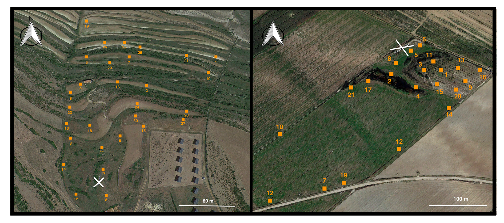

```{r setup, echo=FALSE}
# set global chunk options: 
library(knitr)
opts_chunk$set(cache=TRUE, autodep = TRUE)
dep_auto()
```

## Objectives

## Field sampling

Two distinct locations are being monitored with different historical land-use and management in the region of Aragón (Spain): Cantavieja (40º 30' 44", N 0º 22' 59" W) at 1450m above sea level with a total of 30 plots and Ejea de los Caballeros (42º 01' 06" N, 1º 08' 53" W) at 350m with a total of 21 plots. Plot size is 2m by 2m and they are randomly distributed within each location (see **Figure 1**). 


```{r echo=FALSE, out.width='100%', fig.cap="**Figure 1.** Cantavieja (left) and Ejea de los Caballeros (right) locations with the different sampling plots indicated with an orange square plus the plot identifier. The position of the bee hives are shown with a white cross for both locations."}



```


## Data preparation

```{r, warning=FALSE,message=FALSE}

#Data processing and preparation for visualization and analysis

#First,load libraries
library(dplyr)
library(reshape2)
library(bipartite)

#Read data
data <- read.csv("life_polinizadores.csv")

#check structure of the data
#str(data)

#create separate datasets for the two different locations
canta <- data %>% filter(site_id=="cantavieja")
ejea <- data %>% filter(site_id=="ejea caballeros")

#select for now plant and pollinator species to create plant-pollinator networks from transects
canta_species <- canta %>% select(c("plants", "pollinators"))
ejea_species <- ejea %>% select(c("plants", "pollinators"))

#Now aggregate pollinator visits per plant species
canta_aggreagted <- canta_species %>% count(plants, pollinators, sort = TRUE)
ejea_aggreagted <-  ejea_species %>% count(plants, pollinators, sort = TRUE)

#Now convert to a matrix with the help of acast function from reshape library
canta_matrix <- acast(canta_aggreagted, plants~pollinators, value.var="n")
ejea_matrix <- acast(ejea_aggreagted, plants~pollinators, value.var="n")

#Convert NA's to zeros
canta_matrix[is.na(canta_matrix)] <- 0
ejea_matrix[is.na(ejea_matrix)] <- 0
```

## Data visualization

### Location 1 'Cantavieja'

```{r,warning=FALSE,message=FALSE,dpi=300}

#Set species names in italic
par(font = 3)

#Plot location 1
plotweb(sortweb(canta_matrix, sort.order="dec"), method="normal", text.rot=90, col.low = "darkolivegreen1", col.high = "darkorange",col.interaction="gray75",
bor.col.interaction ="NA", labsize =.5)

```

### Location 2 'Ejea caballeros'


```{r,warning=FALSE,message=FALSE,dpi=300}
#Plot location 2
plotweb(sortweb(ejea_matrix, sort.order="dec"), method="normal", text.rot=90, 
col.low = "darkolivegreen1", col.high = "darkorange",
col.interaction="gray75",bor.col.interaction ="NA", labsize =.5)

```


## Analysis of network structure

First we evaluate nestedness, specifically weighted nestedness (NODF) as shown in xxxx and xxxx.

### Location 1 'Cantavieja'

```{r,warning=FALSE,message=FALSE,dpi=300}
#Estimate nestedness for Location 1
(obs <- networklevel(web = canta_matrix, index = "weighted NODF"))

#To know the meaning of our nestedness value we have to compare it with a randomized version
#of our plant-pollinator network

#Create 1000 random versions of our network
nm <- nullmodel(web = canta_matrix, N=1000, method="r2d") #method 2 for quantitative networks

#Prepare data for plotting
null <- unlist(sapply(nm, networklevel, index="weighted NODF")) 

#Plot the distribution of nestedness of the 1000 random networks
plot(density(null), xlim=c(min(obs, min(null)), max(obs, max(null))), 
     main="Comparison of observed network with null model")

#Add our value of nedtedness to the plot
abline(v=obs, col="red", lwd=2)  

#Calculate p-value
praw <- sum(null>obs) / length(null)

```

### Location 2 'Ejea caballeros'

```{r,warning=FALSE,message=FALSE,dpi=300}
#Estimate nestedness for Location 1
(obs <- networklevel(web = ejea_matrix, index = "weighted NODF"))

#To know the meaning of our nestedness value we have to compare it with a randomized version
#of our plant-pollinator network

#Create 1000 random versions of our network
nm <- nullmodel(web = ejea_matrix, N=1000, method="r2d") #method 2 for quantitative networks

#Prepare data for plotting
null <- unlist(sapply(nm, networklevel, index="weighted NODF")) 

#Plot the distribution of nestedness of the 1000 random networks
plot(density(null), xlim=c(min(obs, min(null)), max(obs, max(null))), 
     main="Comparison of observed network with null model")

#Add our value of nedtedness to the plot
abline(v=obs, col="red", lwd=2)  

#Calculate p-value
praw <- sum(null>obs) / length(null)

```


3) Analizar y visualizar de forma reproducible las dos parcelas siguiendo, por ejemplo, estos codigos: https://ibartomeus.github.io/hab-sp_ntw/demo.html (Jose y Nacho)


